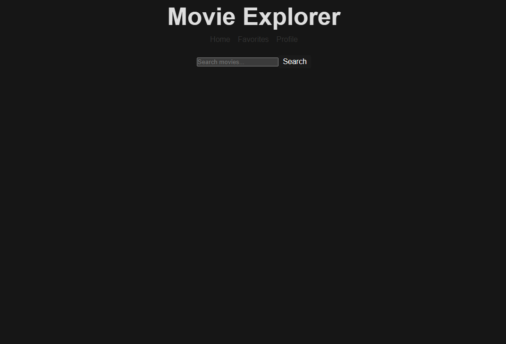
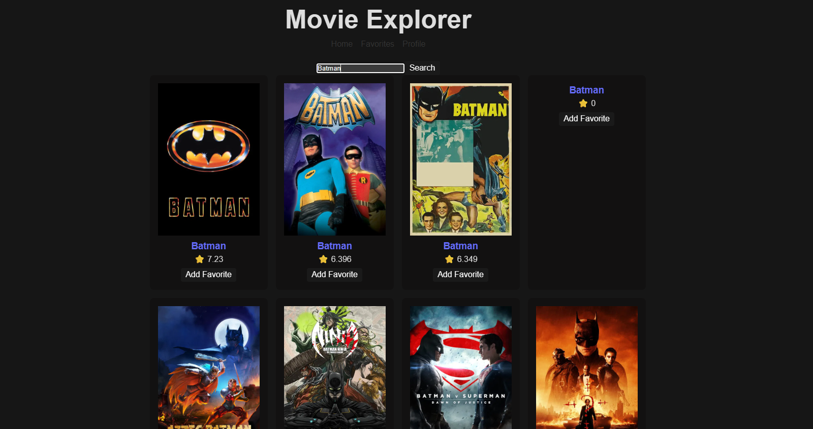
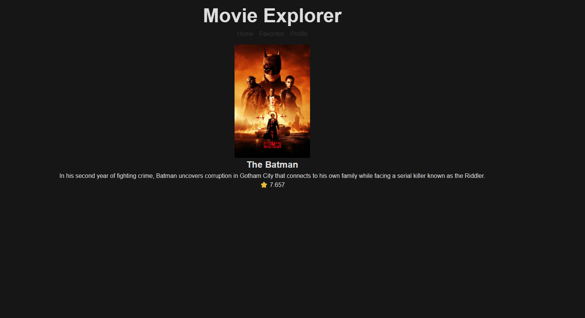
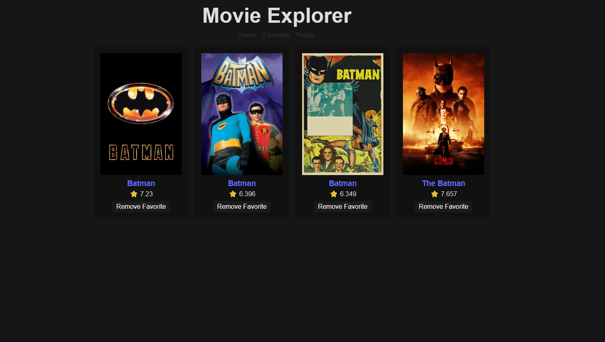
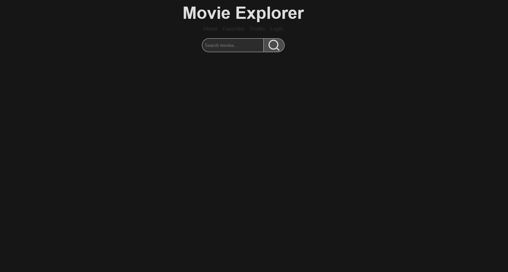
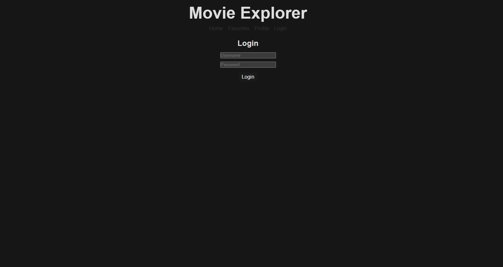
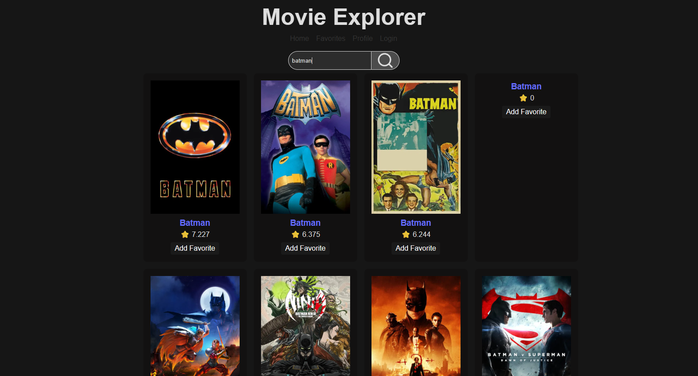

## Description
A React app that lets users search for movies and view details using the TMDb API.

## Tech Used
- React
- Vite
- TMDb API
- Context API

## Setup
```npm install``` 
```npm run dev``` 

## Features
- Search movies
- View details
- Add/remove favorites

## Deployment
https://apd-movie-explorer.vercel.app/

## Screenshots





### Updated Screenshots





## Known Issues / Future Improvements
- Improve styling (further)
- Improve login form styling
- Update Profile page/remove placeholder
- Add logout confirmation
- Automatically showcase movies on home page 
- A non-user can add movies to favorites and see them when logged in.

## Security Implementation
- React automatically escapes user input to prevent XSS attacks.
- Authentication tokens are stored in localStorage and managed through React Context.
- Protected routes prevent unauthorized access to user features.
- Environment variables are used to protect API keys in production.

## Authentication & API Usage

### Authentication Flow
This app uses a simple React Context-based authentication system.

**Login Example:**
```javascript```
import { useContext } from "react";
import { AuthContext } from "../context/AuthContext";

const { login } = useContext(AuthContext);

login({ username: "user", password: "user123" });